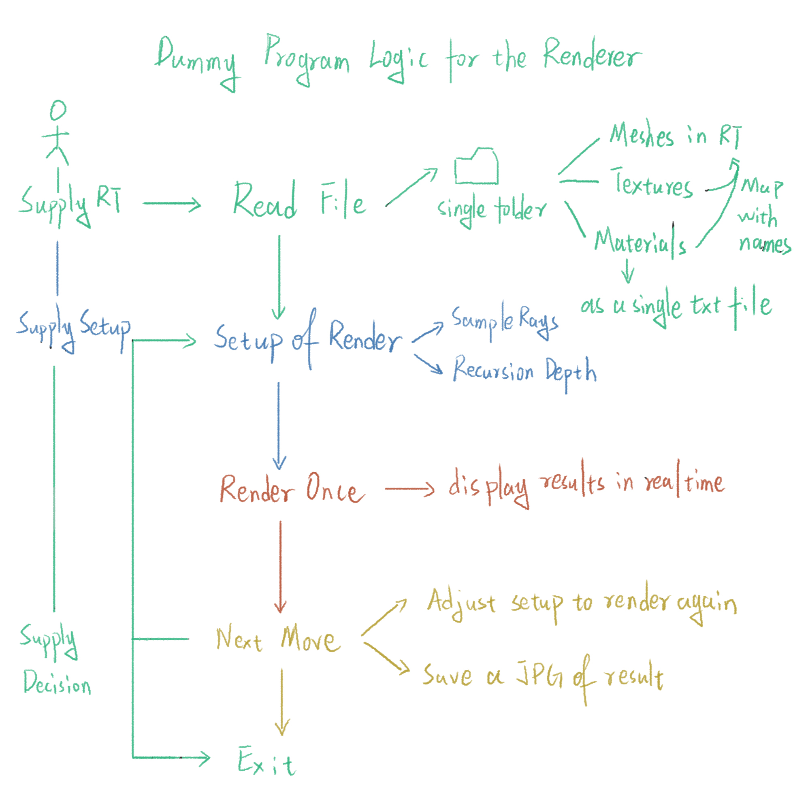

# CS 184 Fall 2016
Instructor: James O'Brien

# Implementer of This Project
Wei Guo: wei.parker.guo.sg@gmail.com

# References (Books & Used Libs Mainly)
1. GLFW Version 3.3.2
2. GLEW
3. ASSIMP Version 5.0.1
4. CUDA
5. linmath.h under GLFW Dependencies
6. Code references are enclosed as inline comments.

# USAGE
This project is platform independant and uses cmake to build. You do need an **Nvidia GTX GPU** if you plan to build the Cuda version.

## [General Build Steps]
Should work for any IDEs as long as you have cmake version >= 2.8.

1. ‘cd’ into your clone directory, type into the Terminal the following step by step
2. mkdir build
3. cd build
4. cmake ..
5. make
6. run the raytracer.exe in build
7. Supply the root folder of your scene to load, otherwise default to existent one called testScene (make sure your textures and materials are named properly!)
8. if you wish to use custom setup for options, type the options line by line in a txt file in build and specify it when program opens.
9. there is a template options.txt inside src, you can copy, rename and modify it to start quicker.

## [For Windows Visual Studio Build Only]
This is the exact repulication of the implementer's build process.

1. ‘cd’ into your clone directory, type into the Terminal the following step by step
2. mkdir build
3. cd build
4. cmake ..
5. Open Assignment2.sin in build folder with Visual Studio
6. Build entire solution
7. Switch to Folder View in the solution explorer
8. Select Debug-x64 and specify target to be raytracer.exe
9. Build

# Dummy Program Logic Flow

  

# Keyboard features
1. [Space]                Start a new rendering frame
2. [F]                    Make the program fullscreen
4. [Up/Down/Left/Right]   Move the rendered image around
3. [Esc]/[Q]              Quit the program

# Render Results
1. All the logs are recorded in logs.txt in raytracer.exe's directory.

# Features
1. Multiple model file formats supporting.
2. Material editing and creating.
3. Viewport customization.

## Accepted Model Files:
The files accepted by this raytracer will be synced with the accepted file types of Assimp.

**Collada** ( .dae, .xml ) 
**Blender** ( .blend ) 
**Biovision BVH** ( .bvh ) 
**3D Studio Max 3DS** ( .3ds ) 
**3D Studio Max ASE** ( .ase ) 
**Wavefront Object** ( .obj ) 
**Stanford Polygon Library** ( .ply ) 
**AutoCAD DXF** ( .dxf ) 
**IFC-STEP** ( .ifc ) 
**Neutral File Format** ( .nff ) 
**Sense8 WorldToolkit** ( .nff ) 
**Valve Model** ( .smd, .vta ) 
**Quake I** ( .mdl ) 
**Quake II** ( .md2 ) 
**Quake III** ( .md3 ) 
**Quake 3 BSP** ( .pk3 ) 
**RtCW** ( .mdc ) 
**Doom 3** ( .md5mesh, .md5anim, .md5camera ) 
**DirectX X** ( .x ) 
**Quick3D** ( .q3o, .q3s ) 
**Raw Triangles** ( .raw ) 
**AC3D** ( .ac ) 
**Stereolithography** ( .stl ) 
**Autodesk DXF** ( .dxf ) 
**Irrlicht Mesh** ( .irrmesh, .xml ) 
**Irrlicht Scene** ( .irr, .xml ) 
**Object File Format** ( .off ) 
**Terragen Terrain** ( .ter ) 
**3D GameStudio Model** ( .mdl ) 
**3D GameStudio Terrain** ( .hmp ) 
**Ogre** ( .mesh.xml, .skeleton.xml, .material ) 
**Milkshape 3D** ( .ms3d ) 
**LightWave Model** ( .lwo ) 
**LightWave Scene** ( .lws ) 
**Modo Model** ( .lxo ) 
**CharacterStudio Motion** ( .csm ) 
**Stanford Ply** ( .ply ) 
**TrueSpace** ( .cob, .scn )

## Command Line Options:
The command line options are taken as a txt file to be specified when program starts for convenience. 
You can check and modify the options.txt file in src to cook your own options.

• **-dispw n**

This sets the display width of the viewport to be n pixels.

• **-disph n**

This sets the display height of the viewport to be n pixels.

# Additonal Features

