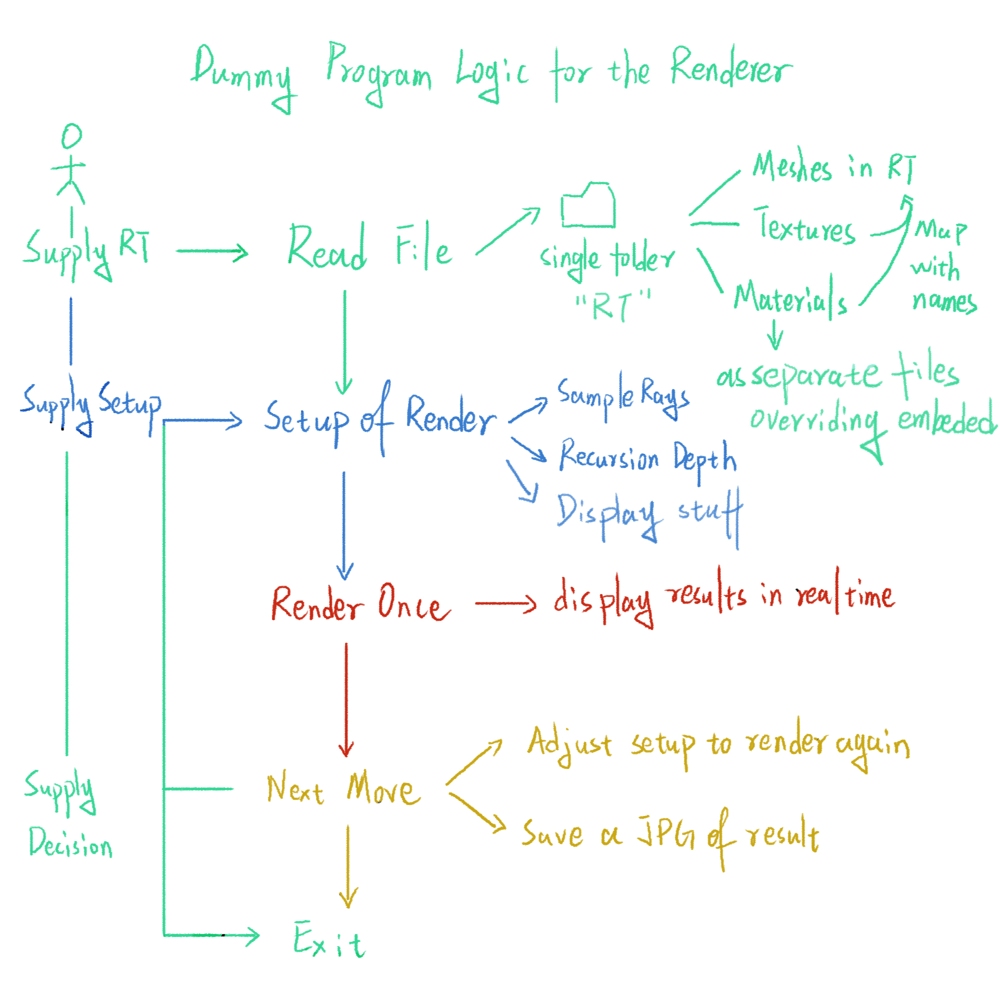
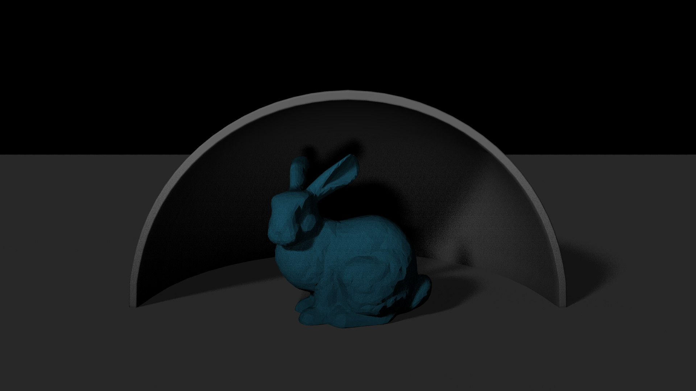
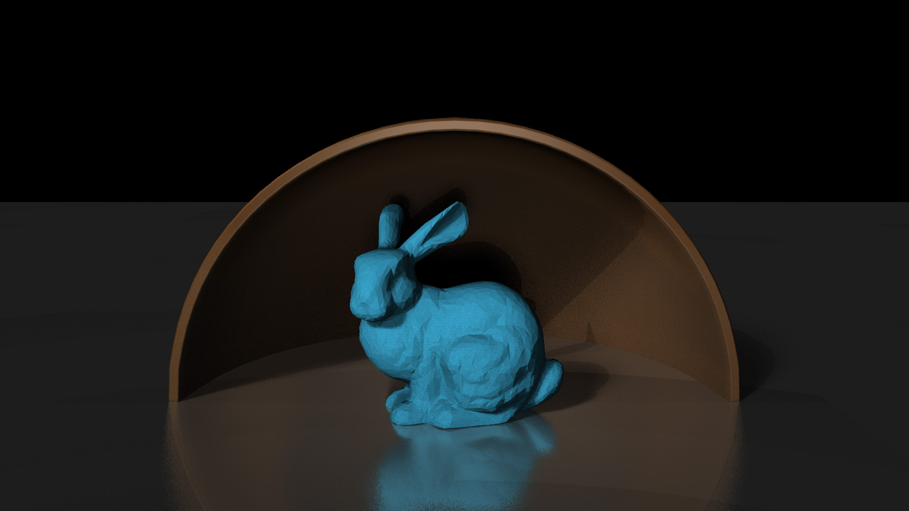

# CS 184 Fall 2016
Instructor: James O'Brien

# Implementer of This Project
Wei Guo: wei.parker.guo.sg@gmail.com

# References (Books & Used Libs Mainly)
1. GLFW Version 3.3.2
2. GLEW
3. ASSIMP Version 5.0.1
4. CUDA
5. dirent.h for directory/file manipulations
6. linmath.h under GLFW Dependencies
8. tooljpeg jpeg encoder from https://create.stephan-brumme.com/toojpeg/
7. Code references are enclosed as inline comments.

# Dummy Program Logic Flow

  

# Render Results
1. All the logs are recorded in logs.txt in raytracer.exe's directory.

2. Render result of the default stanford bunny scene with basic lambert materials and shadow rays with two directional lights:

  

	Samples per pixel: 4 
	Samples per ray: 4 
	Epsilon: 0.000100 
	Ray Jitter Epsilon: 0.100000 
	Max bounces: 3 
	Field of view: 60.00 
	Resolution: 1920 X 1080 

3. Render result of the default standford bunny scene with rabbit as lambert material and other objects as phong reflective:

  

	Samples per pixel: 4 
	Samples per ray: 4 
	Epsilon: 0.001000 
	Ray Jitter Epsilon: 0.100000 
	Max bounces: 2 
	Field of view: 60.00 
	Resolution: 1920 X 1080 

4. Render result of the a bunch of spheres in a mirrored room:

  

	Samples per pixel: 4 
	Samples per ray: 4 
	Epsilon: 0.001000 
	Ray Jitter Epsilon: 0.010000 
	Max bounces: 3 
	Field of view: 60.00 
	Resolution: 1827 X 1077 

5. Render result of three reflective cubes under a point light:

  

	Samples per pixel: 4 
	Samples per ray: 4 
	Epsilon: 0.001000 
	Ray Jitter Epsilon: 0.100000 
	Max bounces: 3 
	Field of view: 54.5 
	Resolution: 1920 X 1080 

5. Render result of three glass balls under a point light (the white artifacts are due to full reflectivity set by the material):

  

	Samples per pixel: 4 
	Samples per ray: 5 
	Epsilon: 0.001000 
	Ray Jitter Epsilon: 0.100000 
	Max bounces: 3 
	Max refractive bounces: 5 
	Field of view: 54.50 
	Resolution: 1920 X 1080 

6. Render result of a bunch of bunnies with different materials:

  

	Samples per pixel: 4 
	Samples per ray: 5 
	Epsilon: 0.001000 
	Ray Jitter Epsilon: 0.100000 
	Max bounces: 3 
	Max refractive bounces: 3 
	Field of view: 54.50 
	Resolution: 1920 X 1080 

# USAGE
This project is platform independant and uses cmake to build. You do need an **Nvidia GTX GPU** if you plan to build the Cuda version.

## [General Build Steps]
Should work for any IDEs as long as you have cmake version >= 2.8.

1. ‘cd’ into your clone directory, type into the Terminal the following step by step
2. mkdir build
3. cd build
4. cmake ..
5. make
6. run the raytracer.exe in build
7. Supply the root folder of your scene to load, otherwise default to existent one called testScene (make sure your textures and materials are named properly!)
8. if you wish to use custom setup for options, type the options line by line in a txt file in build and specify it when program opens.
9. there is a template options.txt inside src, you can copy, rename and modify it to start quicker.

## [For Windows Visual Studio Build Only]
This is the exact repulication of the implementer's build process.

1. ‘cd’ into your clone directory, type into the Terminal the following step by step
2. mkdir build
3. cd build
4. cmake ..
5. Open Assignment2.sin in build folder with Visual Studio
6. Build entire solution
7. Switch to Folder View in the solution explorer
8. Select Debug-x64 and specify target to be raytracer.exe
9. Build

# Features
1. Multiple model file formats supporting.
2. Material editing and creating.
3. Viewport customization.
4. Midpoint Partitioning BVH Tree acceleration for ray hits.
5. Render result saving to jpeg image on program exit.

## Accepted Model Files:
The files accepted by this raytracer will be synced with the accepted file types of Assimp.

**Collada** ( .dae, .xml ) 
**Blender** ( .blend ) 
**Biovision BVH** ( .bvh ) 
**3D Studio Max 3DS** ( .3ds ) 
**3D Studio Max ASE** ( .ase ) 
**Wavefront Object** ( .obj ) 
**Stanford Polygon Library** ( .ply ) 
**AutoCAD DXF** ( .dxf ) 
**IFC-STEP** ( .ifc ) 
**Neutral File Format** ( .nff ) 
**Sense8 WorldToolkit** ( .nff ) 
**Valve Model** ( .smd, .vta ) 
**Quake I** ( .mdl ) 
**Quake II** ( .md2 ) 
**Quake III** ( .md3 ) 
**Quake 3 BSP** ( .pk3 ) 
**RtCW** ( .mdc ) 
**Doom 3** ( .md5mesh, .md5anim, .md5camera ) 
**DirectX X** ( .x ) 
**Quick3D** ( .q3o, .q3s ) 
**Raw Triangles** ( .raw ) 
**AC3D** ( .ac ) 
**Stereolithography** ( .stl ) 
**Autodesk DXF** ( .dxf ) 
**Irrlicht Mesh** ( .irrmesh, .xml ) 
**Irrlicht Scene** ( .irr, .xml ) 
**Object File Format** ( .off ) 
**Terragen Terrain** ( .ter ) 
**3D GameStudio Model** ( .mdl ) 
**3D GameStudio Terrain** ( .hmp ) 
**Ogre** ( .mesh.xml, .skeleton.xml, .material ) 
**Milkshape 3D** ( .ms3d ) 
**LightWave Model** ( .lwo ) 
**LightWave Scene** ( .lws ) 
**Modo Model** ( .lxo ) 
**CharacterStudio Motion** ( .csm ) 
**Stanford Ply** ( .ply ) 
**TrueSpace** ( .cob, .scn )

## Keyboard features
1. [Space]                Start a new rendering frame, if rendering then suspend/continue the render process.
2. [F]                    Make the program fullscreen.
4. [Up/Down/Left/Right]   Move the rendered image around.
3. [Esc]/[Q]              Quit the program.

## Command Line Options:
The command line options are taken as a txt file to be specified when program starts for convenience. 
You can check and modify the options.txt file in src to cook your own options.

• **-dispw n**

This sets the display width of the viewport to be n pixels. n is a positive nozero integer.

• **-disph n**

This sets the display height of the viewport to be n pixels. n is a positive nozero integer.

• **-mpbs n**

This sets the display/calculation domain of a multi-threading block, bigger number actually boosts speed since we are rasterizing less often. n is a positive nonzero integer.

• **-hfov f**

This sets the the horizontal field of view angle for the camera in degrees. A recommended value is 54.43 for human eyes. f is a positive nonzero float.

• **-spp n**

This sets the anti-aliasing samples per pixel used by the raytracer, higher means smoother/slower. n is a positive nonzero integer.

• **-bounce n**

This sets the maximum bouncing time of each light reflect, higher means slower/better viusals. n is a positive integer.

• **-spr n**

This sets the samples splitted out from each ray after a hit for anti-aliasing and soft shadows. n is a positive nonzero integer.

• **-eps f**

This sets the epsilon amount of next ray offset to avoid self-collison. f should be a fairly small positive float.

• **-reps f**

This sets the epsilon amount of splitted ray's offset from the parent ray, higher means softer and more random splits. f should be a fairly small positive float.

• **-rbounce n**

This sets the maximum bounce depth of a refractive ray. n is a positive nonzero integer.

# Additonal Features

